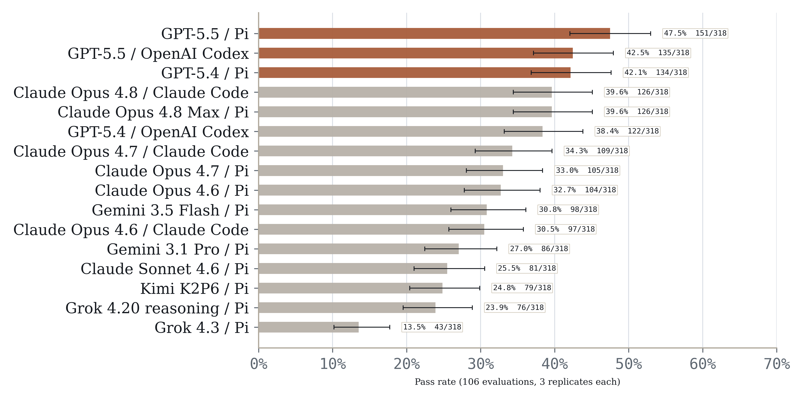
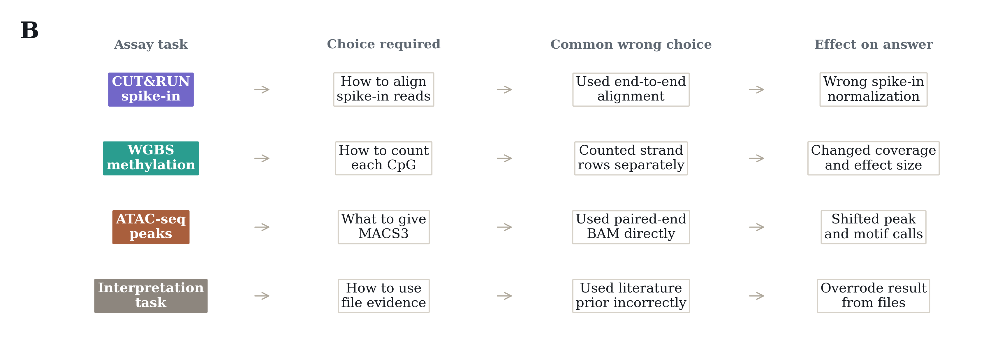
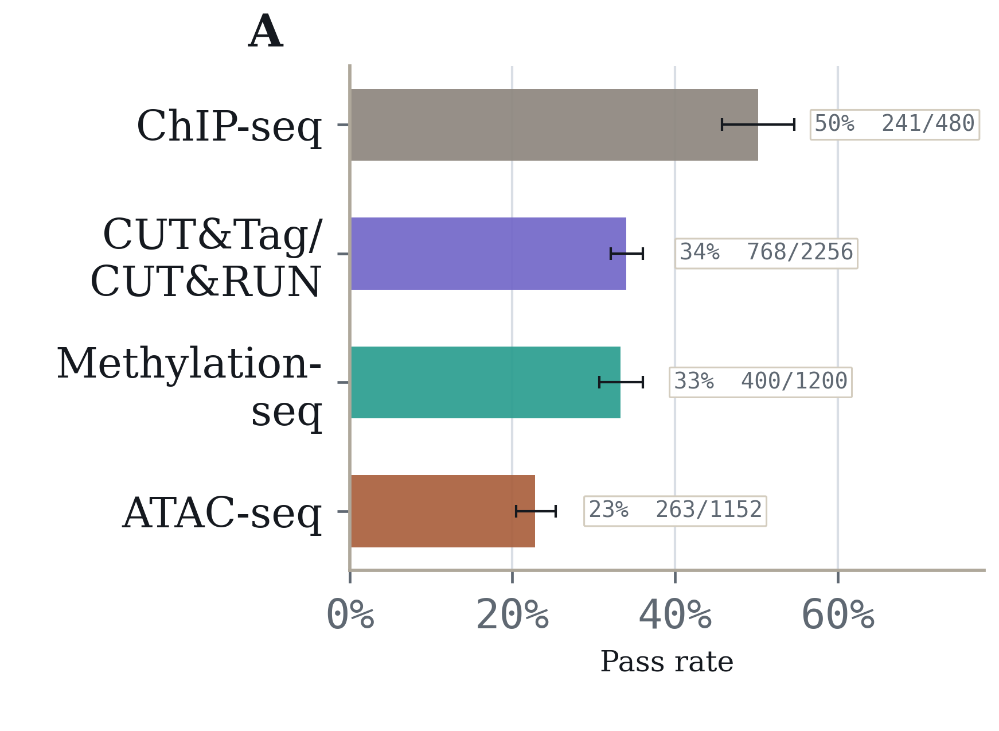

# EpiBench: AI agents still struggle with epigenomics analysis

### Benchmarking frontier models on practical CUT&Tag/CUT&RUN, ATAC-seq, ChIP-seq, and DNA methylation workflows

We introduce EpiBench, a verifiable benchmark for short-horizon epigenomics analysis.

Epigenomics workflows are full of small scientific decisions: which reads to align, what unit to count, how to call peaks, which genomic features to annotate, which statistic to report, and when a result from the provided files should override a familiar biological story.

EpiBench turns these decisions into 106 deterministic evaluations across CUT&Tag/CUT&RUN, ATAC-seq, ChIP-seq, and DNA methylation workflows. Each task starts from a realistic workflow state immediately before a target result. The agent receives files, metadata, and task context, then has to inspect the data and submit a structured answer.

No model-harness pair solves a majority of endpoint attempts. GPT-5.5 / Pi leads at 45.0% (143/318 attempts; 95% CI, 36.3-53.7), followed by GPT-5.5 / OpenAI Codex at 39.9% (127/318 attempts; 95% CI, 31.6-48.3). Claude Opus 4.8 Max / Pi and GPT-5.4 / Pi each reach 39.0% (124/318 attempts; 95% CI, 30.2-47.8 and 31.0-47.0, respectively).

## Epigenomics analysis is hard for current agents

The tasks are short, but they are not trivial. They test whether agents can recover a specific empirical result from assay artifacts, not whether they can describe a generic workflow from memory.

Some examples:

* In CUT&RUN spike-in normalization, agents had to decide how to align spike-in reads.

* In WGBS methylation outputs, agents had to decide how to count a CpG when Bismark reports strand-level rows.

* In ATAC-seq peak calling, agents had to decide what representation to give MACS3.

* In interpretation tasks, agents had to avoid using a literature prior when the provided files supported a different answer.

This is the main failure mode we see across the benchmark: agents often operate the tools, find the right files, and compute useful intermediate values, but still submit an answer that is not supported by the specific assay evidence.

## Performance differs by assay type

CUT&Tag/CUT&RUN has the highest aggregate pass rate at 34.0% (768/2,256 attempts; 95% CI, 25.9-42.2), followed by methylation-seq at 33.3% (400/1,200 attempts; 95% CI, 19.7-47.0) and ChIP-seq at 30.6% (147/480 attempts; 95% CI, 9.1-52.2). ATAC-seq is lowest at 22.8% (263/1,152 attempts; 95% CI, 10.4-35.2).

These numbers should be read descriptively. The assay groups are not a controlled experiment: CUT&Tag/CUT&RUN contributes 47 evaluations, methylation-seq 25, ATAC-seq 24, and ChIP-seq 10, with different task mixes across QC, peak calling, annotation, chromatin-state analysis, and downstream analysis.

Still, the result is useful: agents are not uniformly good or bad at "epigenomics." Reliability depends on the assay representation and the exact scientific decision being asked of the system.

## The benchmark measures judgment, not just tool use

Trajectory review suggests a consistent pattern:

* Agents can locate relevant files and run plausible commands.

* They can compute partial answers or useful intermediate values.

* They often fail when the final answer requires assay-specific judgment.

The wrong answer is frequently nearby: a default tool parameter, a generic statistical summary, an incorrect feature representation, or a familiar mechanism from the literature.

That is why deterministic endpoint grading matters. A task is only marked correct when the final structured answer matches the result supported by the provided artifacts.

## Explore data and trajectories

EpiBench is meant to be inspected. The benchmark includes public example evaluations, result files, and representative trajectories in the repo:

https://github.com/latchbio/epibench

As agents improve, progress on benchmarks like EpiBench should require more than better command execution. It should require better grounding of biological claims in the specific assay artifacts that support them.
